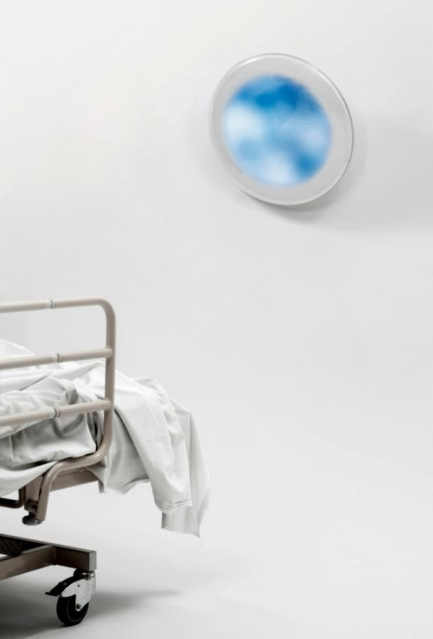
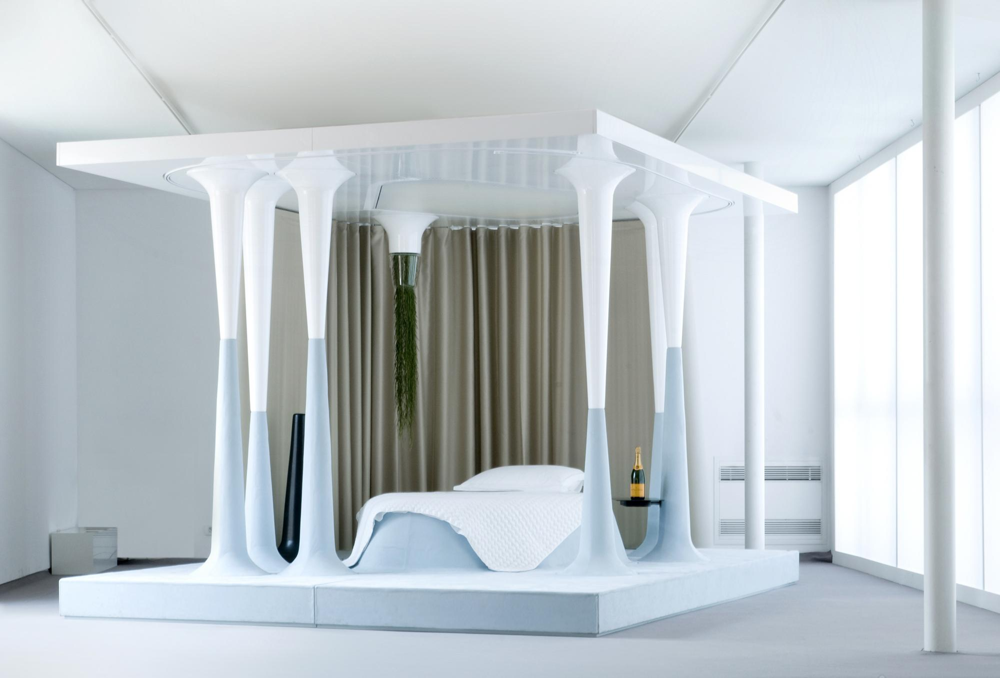
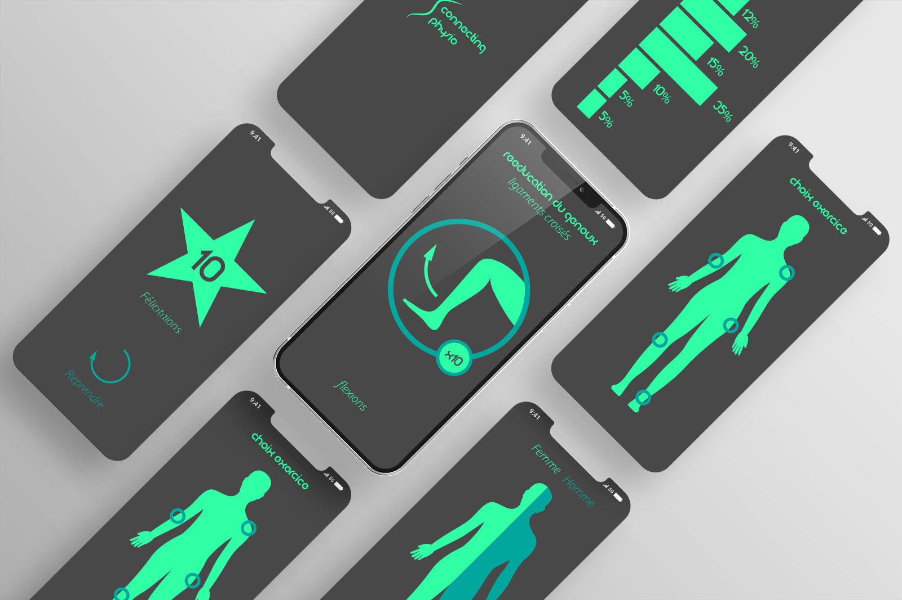
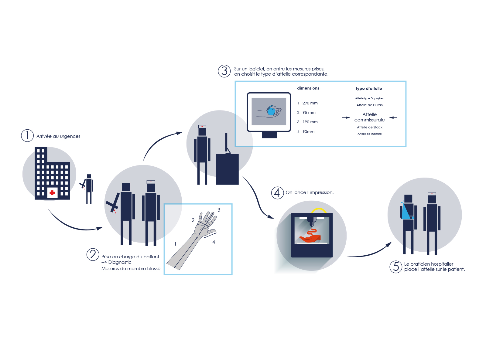
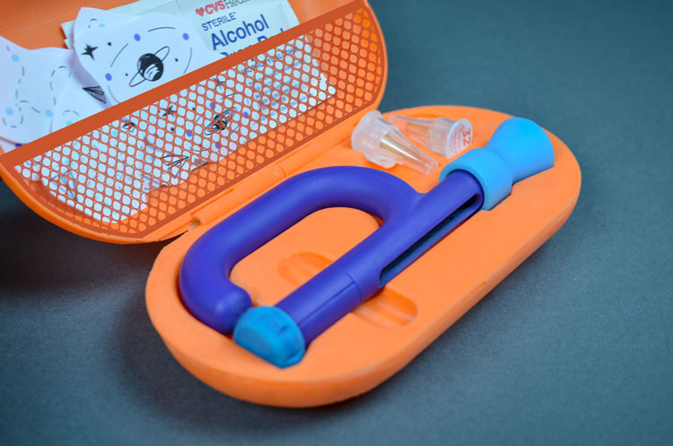

# INSPIRATION

**1. Thermes et definitions**

**Experience utilisateur**  
La notion d’expérience utilisateur marque une évolution disciplinaire (pluridisciplinaire), méthodologique et conceptuelle dans la façon de concevoir la relation de l'utilisateur aux produits et aux systèmes techniques, d'une part, et de considérer leur qualité « ergonomique », d'autre part. Cette évolution passe par la prise en compte des caractéristiques non instrumentales (non liées à l'efficacité, la sécurité ou la fiabilité) des produits et des systèmes techniques, soit l'apparence, l'esthétique, le plaisir, l'émotion, etc

**Soin**  
Avoir, prendre soin de (qqn, qqch)
S'occuper du bien-être et du contentement de (qqn), du bon état de (qqch.)

**Santé**  
Fonctionnement plus ou moins harmonieux de l'organisme, sur une période assez longue
Bon état physiologique d'un être vivant, fonctionnement régulier et harmonieux de l’organisme

**patient**  
Le malade, la personne qui consulte
Personne qui est l'objet d'un traitement, d'un examen médical, d'une opération chirurgicale

**Technologies**  
ensemble cohérent de savoirs et des pratiques relatives à un domaine particulier, permettant leur utilisation efficace 
étude des techniques, le recensement systématique des procédés, des méthodes, des outils ou machines spécifiques à un ou plusieurs domaine(s) technique(s) ou métier(s) de l’industrie
ensemble des termes techniques propres un art, à une science, à un métier, à un domaine particulier.

**Milieu hospitalier**  
Position centrale, entourage matériel et moral relatif aux hôpitaux

**Ergonomie**  
Étude scientifique des conditions de travail et des relations entre l'être humain et la machine Adaptation d'un environnement de travail (outils, matériel, organisation…) aux besoins de l'utilisateur.

**Confort**  
Ce qui contribue au bien-être, à la commodité de la vie matérielle.
Tranquillité psychologique, intellectuelle, morale obtenue par le rejet de toute préoccupation.
Ensemble des commodités, des agréments qui produit le bien-être matériel ; bien-être en résultant

**Care Design**  
Ethique de la sollicitude qui entend redefinir la conception par une approche plus sensible à autrui 

**Design thinking**  
Approche centrée sur l’humain ; production d’objet et de service désirable par le consomateur même s’il n’aurait jamais exprimé clairement le voeu 

**2. Potentiels questionnements** 

- Quelle est la place de l’experience utilisateur dans la conception d’un produits ou service de santé ?

- Comment ameliorer l’accompagnement du patient face a un diagnostique de maladie grace aux technologies ? 

- Quels est l’impact de l’utilisation des technologies sur le milieu hospitalier ? 

- Quel est le lien entre les technologies et le confort des patients ?

**3. References**

- Couleurs et soin - Barbara Bay et Claire FayolleDesign et pensée du care pour un design des microluttes et singularités - Jehanne Dautrey  
- L’inovation sociale par le design en santé - Science du design  
- Design en santé : comment changer d’échelle ?  
https://www.sciencespo.fr/chaire-sante/sites/sciencespo.fr.chaire-sante/files/Programme_05-01-2018%20ScPo-ENSCI%20(1).pdf 
- Mathieu Lehanneur - Mathieu Lehanneur 
- Séminaire Design with Care - Cynthia Fleury et Antoine Fenoglio 
https://chaire-philo.fr/wp-content/uploads/2018/11/DesignWithCare-1.pdf 
- Le patient comme acteur du design en e-santé : design participatif d’une application mobile pour patients cardiaques - Sciences du Design  
- Le blog sur la santé et le design  
https://medicaldesign.fr/blog-design-sante/ 
- L’UX dans le secteur de la santé 
https://lagrandeourse.design/blog/actualites/lux-dans-le-secteur-de-la-sante/ 
- Design et territoires de pratiques en santé : enjeux pour la recherche et la formation - Science du Design (6) 
- UX Design applied to Health. Considering patient’s digital experience in order to help conception of mobile application. Approach, method, results. - Clément Gravereaux 
https://sfsic2020.sciencesconf.org/337124/document 
- Health Design Thinking: Creating Products and Services for Better Health - Bon Ku et Ellen Lupton 

**4. Visuels**  

 
  
- Tomorow is another day - Mathieu Lehanneur  
 

  
- Once upon a dream - Mathieu Lehanneur  
 

  
- La rééducation du genoux - Matthieu Robert  
 

  
- Impression 3D urgence - Matthieu Robert  
 

  
- Thomy kit pour enfants diabétiques - Renata Souza  

